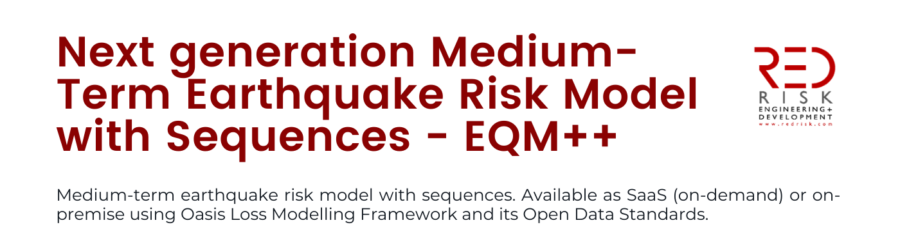

# 1 Key Specifications

**EQM++** extends the EQM+ framework by implementing a **conditional ETAS approach**, enabling **medium-term, dynamic risk estimates** anchored on recent seismic activity.  
* [**EQM**](https://github.com/OdabasiOmer/Ored/tree/main): mainshock-only, memory-less (Poissonian).  
* [**EQM+**](https://github.com/OdabasiOmer/ored-eqmp): mainshocks + aftershocks via **unconditional ETAS**.  
* **EQM++**: conditional ETAS triggered by recent observed events, producing **dynamic medium-term risk estimates**.

<p align="center">
  
</p>

For the full technical specifications, check out on `redserver`:

```
P:\RED--EU-EQ-Model-Update-2023\07_reports_and_presentations\06 - Technical Documentation\model\r2\appendix\EQM++v1.pdf
```
a copy of which can also be accessed [here](https://cloud.redrisk.com/nextcloud/index.php/s/iFxQNQGJHcj3fa7?dir=undefined&path=%2Fdoc-technical&openfile=2108053). 

In short:  
* **Catalogue**: Year-specific stochastic catalogs incorporating observed mainshocks and their simulated aftershocks (minimum magnitude M4.6).  
* **Time scale:** Focuses on **conditional, medium-term risk** (yearly updates).  
* **Geographic coverage:** Italy (other countries pending).  
* **Occurrence model:** Mainshocks observed from INGV, aftershocks generated with ETAS conditioned on recent events.  
* **Ground motion:** Five Sa ordinates (T=0.2, 0.3, 0.5, 0.75, 1.0s).  
* **Uncertainties:** Epistemic + aleatory (spatial correlation included).  

<p align="center">
  
</p>

# 2. Core modelling decisions and assumptions 
### 2.1 Occurence Process
* **Underlying model**: ETAS (space–time Hawkes process).  
* **Modification in EQM++**:  
  - Uses the EQM mainshock catalog as the background (unconditional) events.  
  - Aftershocks are generated conditionally:the year-of-interest catalog includes EQM mainshocks and the aftershocks they trigger (unconditional). In addition, aftershocks triggered by observed earthquakes from prior years are simulated
* **Result**: EQM++ dynamically updates risk estimates based on the previous year’s seismicity.


### 2.2 Event Set Generation

EQM++ generates **conditional earthquake catalogs** combining two components:  

1. **Unconditional events** – Mainshocks from the EQM catalog for the year of interest and the aftershocks they trigger within the same year.  
2. **Conditional events** – Aftershocks triggered by earthquakes that occurred **before the start of the year of interest**, which can produce additional events in the year of interest. These events are downloaded from the [INGV website](https://shakemap.ingv.it/).

Together, these components produce a stochastic catalog reflecting both the natural variability of seismic sequences in the year of interest and the influence of prior seismicity.  

For implementation details, see the corresponding [codebase](https://bitbucket.org/red-eq/ses-tools/src/main/aftershock-simulator/).

### 2.3 Ground motion characterization

Identical to the framework we have in [**EQM+**](https://github.com/OdabasiOmer/ored-eqmp).