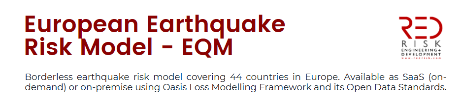

# 1 Key Specifications

For the full technical specifications, check out on `redserver`:

```
P:\RED--EU-EQ-Model-Update-2023\07_reports_and_presentations\06 - Technical Documentation\model\r2
```
a copy of which can also be accessed [here](https://cloud.redrisk.com/nextcloud/index.php/s/mzNnBp2QHMbjbC6). 

In short,
* 30,000-year stochastic catalog of 952,000 events, consistent with the 2020 European Seismic Hazard Model [ESHM20](http://www.hazard.efehr.org/en/Documentation/specific-hazard-models/europe/eshm2020-overview/).
* Ground shaking only
* Explicit treatment and propagation of epistemic and aleatory uncertainties
including primary and secondary uncertainties.
* Explicit modeling of spatially correlated ground motion intensity fields for every event during sampling.


# 2. Core modelling decisions and assumptions 
### Ground motion sampling
Depending on choice, legacy REDLoss allowed for ground motion sampling by either using the total sigma, or between- and within-event sigmas.
... NS

### Spatial correlation
How it currently works...
NS

> (TODO-OO) Future direction:

### (SES) Paramer calibration
* Parameter calibration is normally country specific. We decided to use Italy params to generate SES for also other countries.

### Zonation (regions - old approach) during event set generation
... NS

### Sampling from logic tree
... NS

### 


